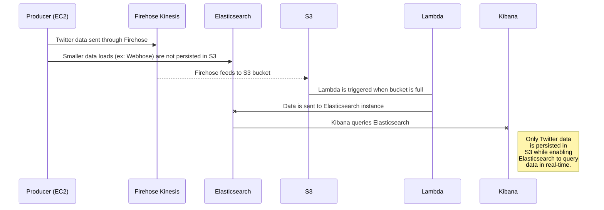

# Building a Streaming Social Media Analytics Platform

## Setting it all up

Follow this great [AWS blog](https://aws.amazon.com/blogs/big-data/building-a-near-real-time-discovery-platform-with-aws/) to get started.  It provides the source code and explains the over all architecture which looks something like this: 


Start by following all of the steps in the AWS blog as described and then tweak as needed. For tweaks, I found I wanted to make changes to the Elasticsearch mappings in the Twitter streamer.  Since ES mappings can be tricky, its worth checking out some other examples, e.g. my code is [here]([https://github.com/silaseverett/aws-elk-data-stream](https://github.com/silaseverett/aws-elk-data-stream)) .

At this stage I'm assuming you have completed the above set up successfully and have:

- AWS command line interface (CLI) installed on local host
- AWS EC2 instance running

## Add more social media streams
If you have set up Twitter as per [AWS blog](https://aws.amazon.com/blogs/big-data/building-a-near-real-time-discovery-platform-with-aws/) you may want to make some tweaks and add some more social media sources.  

[Webhose]('https://webhose.io/') is a great all in one almost live data source for news and blogs feed.  The steps to setting it up are:

1. Login to your EC2 instance
2. Install tmux
```
$ sudo apt-get install tmux
```
4. Clone the git repo
```
git clone https://github.com/silaseverett/aws-elk-data-stream.git
```
5.  Sign up for webhose and then go to your dashboard `https://webhose.io/dashboard` and scroll down to the API key. Copy it.
6. Configure `webhose.py` with your webhose API key. Check out the [webhose API playground]([https://webhose.io/web-content-api](https://webhose.io/web-content-api)) for making the query string that fits your need. 
```
$ cd webhose
$ vi confighose.py
```
Then paste your webhose API token.
 
7. Set up the viritual environment for the webhose producer and activate it:
```
$ virtualenv my_env
```
8. Start a tmux session 
```
$ tmux
```
9. Activate the virtual environment:
```
$ source ~/environments/my_env/bin/activate
```
10. Start the webhose producer.
```
$ python webhose.py
```


## Modifying the platform
When you want someone to then modify the analytics platform you have just built start here.  These notes assume you have login permissions to AWS Cloud Services, a basic knowledge of Amazon Cloud, Twitter, Webhose.io, and command line interface commands.  The object of these instructions are to (1) enable changes to the search terms used for filtering web documents into Elasticsearch and Kibana and (2) basic maintanence of the tool in cases where it needs to be restarted.
 


## Task 1: Modifying Search Term Filters

Modifying the search term filters requires logging on to the EC2 instance, then stopping the message producers (Twitter and Webhose.io), opening and modifying the producer files.  So first logon to EC2 instance. Follow log on instructions above.  

### [Twitter](twitter.com)
1.  Change/open directory twitter-streaming-firehose-nodejs
```
$ cd twitter-streaming-firehose-nodejs
```
2. Edit the config.js file 
```
$ vim config.js
```
**Vim** is a classic if not archaic editor as you can see, but it's the one built in to Ubuntu.  Scroll down to bottom of the file and you will see the 'terms'.  In order to make modifications:
```
hit 'i' key for insert
use arrow keys to navigate to the "terms" section
make changes
hit 'esc' then a colon ':' 
then enter 'wq' to write to file and quit vim
(if no changes are desired enter 'q' instead of 'wq' to exit vim)
then hit return 
```

3. Changes will not happen until the Twitter producer is stopped and started again.  See last section on starting and stopping the producers.

### Webhose.io
1. Open the webhose directory
```
$ cd webhose
```
2.  Edit the config file 'configwhose.py'
```
$ vim configwhose.py
```
While in vim, you'll find the terms in the 'query_params' dictionary at the top of the file.  You can set the query params in accordance with [webhose.io API playground](https://webhose.io/web-content-api) output integrate box for Python.  

Since we are now in Vim:
```
hit 'i' key for insert
use arrow keys to navigate to the "query_params" at the top
make changes
hit 'esc' then a colon ':' 
then enter 'wq' to write to file and quit vim
(if no changes are desired enter 'q' instead of 'wq' to exit vim)
then hit return 
```
3. Changes will not happen until the webhose producer is stopped and started again.  See next section for how to stop and start the producers.


## Task 2:  Starting and Stopping Data Producers

Log on to EC2 instance following directions above.

### [Twitter](twitter.com)
#### Stopping

1.  First, list all the existing tmux sessions
```
$ tmux list-sessions
```
3.  Bring up the tmux session that holds the producer windows (default is only one is available).
```
$ tmux attach-session -t 0
```
4.  Now in tmux, toggle to the second of three stacked windows on the screen
```
ctrl 'b'
hit down arrow once
```
5. Kill the Twitter producer
```
ctrl 'c' 
type 'exit'
```
#### Starting
1.  Change/open directory 'twitter-streaming-firehose-nodejs'
```
$ cd twitter-streaming-firehose-nodejs
```
2.  Run 'twitter_stream_producer_app' with Node.js
```
$ node twitter_stream_producer_app
```
3.  End the tmux session by toggling to the first window
```
ctrl 'b'
then up arrow
```
and detach tmux:
```
$ tmux detach
```

### Webhose.io
#### Stopping*

1.  List all the existing tmux sessions
```
$ tmux list-sessions
```
3.  Bring up the tmux session that holds the producer windows (default is only one is available).
```
$ tmux attach-session -t 0
```
4.  Now in tmux, toggle to the second of three stacked windows on the screen
```
$ ctrl 'b'
hit down arrow twice
```
4. Kill the webhose producer (notice that webhose is running in Python2.7 virtualenv)
```
(my_env) $ fg %1
(my_env) $ ctrl 'c'
```

####  Starting*

1. Go into webhose directory and run the producers py script.
```
(my_env) $ cd webhose 
(my_env) $ python webhose_producer.py
```
3.  End the tmux session by toggling to the first window
```
ctrl 'b', then up arrow
```
and detach tmux:
```
$ tmux detach
```

***Note: the webhose.io producer is run from a Python2.7 virtual environment. To activate the env
```
$ source ~/environments/my_env/bin/activate
```
You will see (my_env) in the front of the command prompt when activated.


## Important URLS to track along the way

> CloudWatch
> ElasticSearch
> Kibana
> S3 
> Lambda
